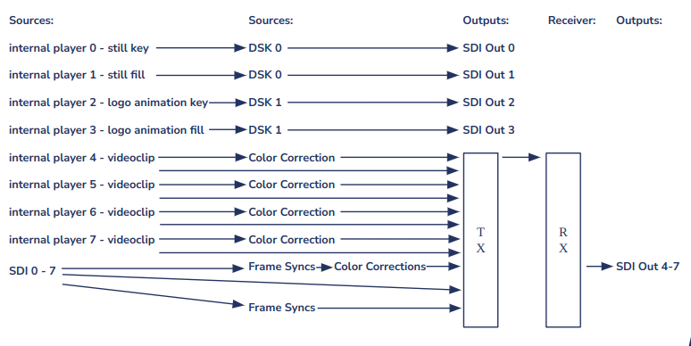
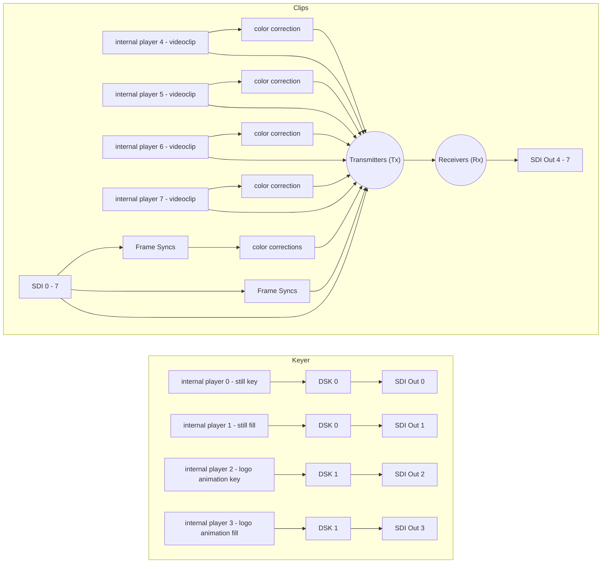

# Demo Setups

This repository contains manuals and scripts for preconfigured BLADE//runner setups.

## Demo Setup #1 (1080p50/1080p59.94)

This demo setup is intended to provide an overview of the functions of the blade runner - at300 AVP app.
It contains the functions video transmitter, video receiver, video delays (configured as frame synchronizer), color corrections and video mixer. The demo setup can be set up with the 1080p50 and 1080p59.94 standards.
In the demo setup, the blade uses internal players loaded with clips and SDI inputs as video sources. 

To use the SDI inputs as sources, connect video signals of the same standard as in the demo setup to the BNC connections configured as inputs. These sources are routed through the various functions and then streamed via the 100G front ports. These streams can be received by the same blade by connecting the 100G ports together.
To do this, you must short-circuit the two front ports.
The requirements for this demo are as follows:
- AT300 blade with the AVP app
- 1x I/O module 
- compatible QSFP28 module
- Formatted USB stick with the [sample clips](https://www.dropbox.com/scl/fo/rlgvdjcl8u2yadu79qaip/h?rlkey=y4b5w42qtikdqbszxe2ohnf2d&dl=0)

> [!WARNING]
> Please note! The clips may not be renamed and all files have to be copied to the root directory of the stick, not in folders/subdirectories.

To start the demo setup, connect your at300 to the power supply, insert the USB stick with the video clips into 
the front usb-c port and open the user interface. Now check in the dropdown menu whether you have loaded 
the AVP app on your blade. If this is not the case, please boot your blade in the "AVP_100GbE" app. 

> [!WARNING]
> Please note! If you have previously set up the demo setup in a different video standard, please reset your blade once using the "Reset" button in the drop-down menu.

In the next step, please select "Demo setup #1" with the desired standard from the dropdown 
menu under "Demo menu". Start the demo setup by clicking on "Demo Setup #1". 
After the demo setup has been loaded, the blade is configured as follows:

### Blade Configuration

8x internal players with clips loaded from the USB stick:
-	player 0 & 1: logo still - blade runner (key & fill)
- player 2 & 3: logo animation (key & fill)
- player 4 - 7: Videoclips

For a 16x bidirectional I/O module, connections:
- 0-7 are configured as inputs 
- 8-15 as outputs

The at300 is booted in "Free Run" PTP mode and therefore requires no external PTP timing. 
- 8x image synchronizers
- 12x color correctors
- 4x video mixers
- 32x 3G video streams and 
- 32x 3G video receivers are created as functions. 

Two of the four video mixers are configured as A/B video mixers, the others as luma keyers. 
The luma keyers use the signals from video players 0-3 as key & fill signals. 

### Routing

The internal signal routing of the blade can be seen here:

> [!NOTE]
>  Please note!
> All video signals can be used as sources for functions.
However, video mixers should not be cascaded as they require shifted time sources. 
These can be created manually, but are not initially intended for the demo setup. 

Routing as mermaid graph:

## Demo Setup #2 (1080p50/1080p59.94)

This demo setup is largely identical to demo setup #1. The main difference is that one blade does not send streams to itself, but two blades wired together are used to send streams to each other. To do this, connect the respective 100G ports 0 to 0 and 1 to 1. 

The base setup of each blade is identical as described in [demo setup #1 - Blade Configuration](#blade-configuration) with on difference: only SDI outputs 8 and 9 are configured to be able to utilize one 16bidi and one MSC2 IO module.

As a result, the full requirements are:

- 2x AT300 blade with the AVP app
- 2x I/O module 
- compatible QSFP28 module
- 2x Formatted USB stick with the [sample clips](https://www.dropbox.com/scl/fo/rlgvdjcl8u2yadu79qaip/h?rlkey=y4b5w42qtikdqbszxe2ohnf2d&dl=0)

> [!IMPORTANT]
> The clips may not be renamed and all files have to be copied to the root directory of the stick, not in folders/subdirectories.
